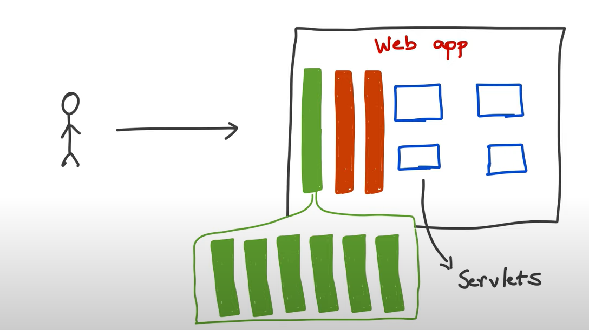
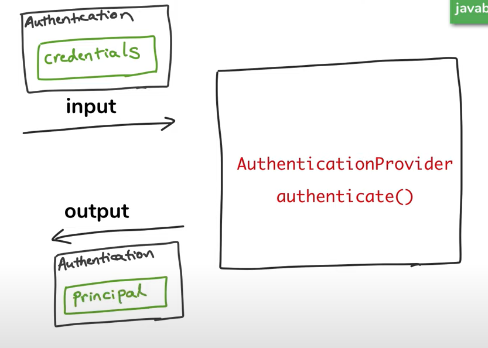
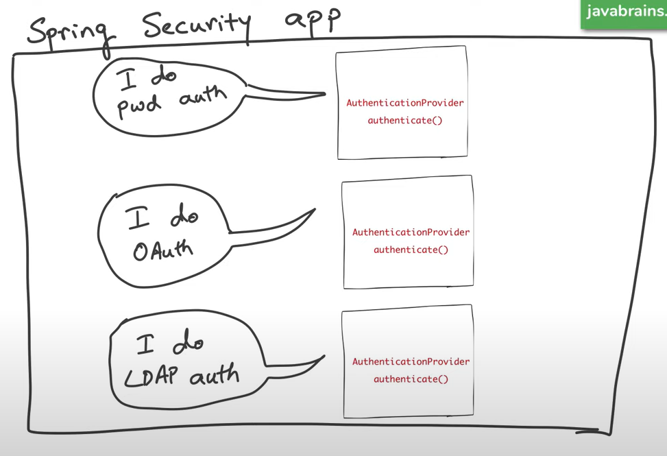
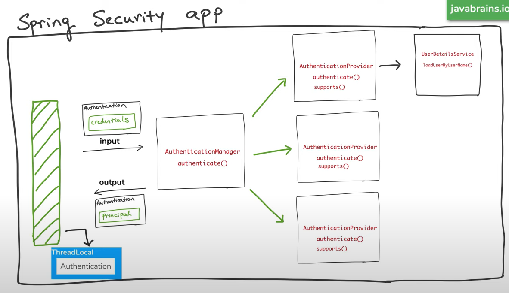

# Default Spring Security

YT Link - https://www.youtube.com/watch?v=PhG5p_yv0zs&list=PLqq-6Pq4lTTYTEooakHchTGglSvkZAjnE&index=3

Just by adding `spring-boot-starter-security` in pom file it will add spring security filter and it will ask you for login id and password

The default username will be - user

The default password will be given when you start project.

* Adds mandatory authentication for all URLs (APIs)
* Adds Login form
* Handles Login error
* Create a default user and sets a password

You can change default username and password by adding below properties in application properties file

* spring.security.user.name
* spring.security.user.password

After giving custom username and password, spring won't generate default password

### _It works on session based._

------------------------------------------------------------------------
# Configure Spring Security Authentication

YT Link - https://www.youtube.com/watch?v=iyXne7dIn7U&list=PLqq-6Pq4lTTYTEooakHchTGglSvkZAjnE&index=4

That one was default security. we can not add all users in prop file. we have to fetch from DB

AuthenticationManager has method `authenticate()` which will authenticate. we just have to configure `AuthenticationManager`

We won't directly work with `AuthenticationManager`. Instead, we will work with `AuthenticationManagerBuilder` to configure what `AuthenticationManger` should do

SpringSecurity has a class which will get `AuthenticationManagerBuilder` as input and create new `AuthenticationManager`.

We just have to override that class and configure own security. if we won't do then it will pick default config

And that class is `WebSecurityConfigurerAdapter` 

* `PasswordEncoder` is necessary for this configuration 
------------------------------------------------------------------------
# Configure Spring Security Authorization

YT Link - https://www.youtube.com/watch?v=payxWrmF_0k&list=PLqq-6Pq4lTTYTEooakHchTGglSvkZAjnE&index=5

|   API         | Roles Allows to access it |
| :-----------  :|:-------------             :|
| /             | All (Unauthenticated)     |
| /user         | USER & ADMIN Roles        |
| /admin        | ADMIN Role                |

`HttpSecurity` will do this.

The Same `WebSecurityConfigurerAdapter` will have method to configure `HttpSecurity`

That one was default security. we can not add all users in prop file. we have to fetch from DB

AuthenticationManager has method `authenticate()` which will authenticate. we just have to configure `AuthenticationManager`

We won't directly work with `AuthenticationManager`. Instead, we will work with `AuthenticationManagerBuilder` to configure what `AuthenticationManger` should do

SpringSecurity has a class which will get `AuthenticationManagerBuilder` as input and create new `AuthenticationManager`.

We just have to override that class and configure own security. if we won't do then it will pick default config

And that class is `WebSecurityConfigurerAdapter`

* `PasswordEncoder` is necessary for this configuration
------------------------------------------------------------------------

# How Spring Security Authentication Works

YT Link - https://www.youtube.com/watch?v=caCJAJC41Rk&list=PLqq-6Pq4lTTYTEooakHchTGglSvkZAjnE&index=6

**AuthenticationManager - authenticate()**

**AuthenticationProvider - authenticate(), supports()**

**UserDetailsService - loadUserByUserName()**

##### Multiple Filters before reaching to servlet. which can stop the request and check the request params

##### Authentication Provider

##### To Coordinate between this authentication Provider we will need AuthenticationManager

##### And AuthenticationProvider will use userDetailsService to fetch user details

------------------------------------------------------------------------
